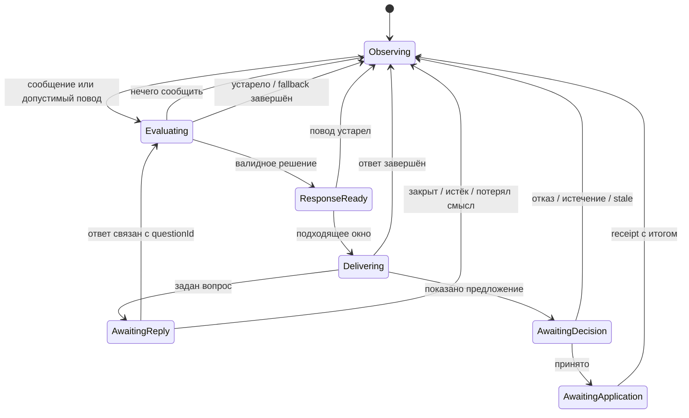

# Live Coach: архитектура поведения и восстановления

Ход реализации: [backend-срез и оставшиеся этапы](live-coach-behavior-implementation.md).
Дата: 2026-09-19. Статус: предложение для обсуждения, не реализовано.

Основание: изучение backend, SQL-миграций 021–023, тестов и документации playground.
Android-код в рамках этого исследования не проверялся: клиентские изменения ниже — требования
к будущему контракту, а не подтверждение текущего поведения приложения. Продуктовый baseline —
текстовый тренер; голос рассматривается как расширение.

## 1. Решение

Использовать иерархическую модель состояний с независимыми областями, чистую функцию переходов
на Kotlin и существующее durable-выполнение в PostgreSQL. LLM интерпретирует запрос,
объясняет и формирует кандидата решения. Код определяет разрешённость, момент показа,
актуальность и применение. Один последовательный обработчик событий на сессию;
медленные вызовы модели выполняются вне транзакции.

Необходимые области: ход тренировки, диалог, предложение, выполнение задачи и доступность.
Не объединять их в enum с комбинациями вроде RESTING_THINKING_OFFLINE.

Главный критерий: человек может продолжать тренировку при сбое AI, а восстановление
не создаёт повторных изменений, устаревших указаний и лавины сообщений.

## 2. Как работает сейчас

1. Android/playground передаёт снимок через PUT sessions/{workoutId}; сообщения идут через
   POST sessions/{workoutId}/messages. Есть совместимый POST runs.
2. CoachRunService проверяет eventId/requestId, digest и sequence, сохраняет снимок и задачу.
   Повтор того же запроса возвращает прежний результат; другой payload с тем же ID конфликтует.
3. semanticVersion исключает часы наблюдения, elapsed_seconds, pulse и некоторые countdown-поля.
   evaluate сравнивает снимки и вызывает CoachRunTools.initiative.
4. Инициатива реагирует на изменение последнего выполненного подхода или малый остаток времени;
   учитывает память отказов и AutoregulationEngine. Отдельный scanner проверяет дедлайн времени.
5. Worker берёт QUEUED либо RUNNING с истёкшей арендой. Есть FIFO внутри тренировки,
   lease 90 секунд, обновление каждые 20 секунд, fencing по токену и состоянию.
6. CoachRunExecutor восстанавливает messages/tool results из checkpoint; даёт модели доступ
   к состоянию, истории, каталогу и submit_workout_changes. Последний создаёт предложение.
7. Ограничения: до 8 логических запросов модели, 24 вызовов инструментов, 10 минут выполнения;
   один немедленный повтор provider-вызова для timeout/unavailable. Proposal живёт 5 минут.
8. События хранятся в БД; SSE всей тренировки поддерживает курсор и Last-Event-ID.
   Отсоединение подписчика не отменяет задачу.
9. Клиент применяет подтверждённое предложение и отправляет APPLIED/REJECTED/STALE.
   Сервер сохраняет решение с причиной и фактами для следующей инициативы.

Основные точки кода:

- [CoachRunService](../src/main/kotlin/tech/valerochkagym/service/ai/CoachRunService.kt): message,
  session, receipt, evaluate, scheduleTimers, runNext, fenced, semanticVersion.
- [CoachRunExecutor](../src/main/kotlin/tech/valerochkagym/service/ai/CoachRunExecutor.kt):
  checkpoint/tool loop, streaming, decodeAnswer.
- [CoachRunTools](../src/main/kotlin/tech/valerochkagym/service/ai/CoachRunTools.kt):
  validation операций и initiative.
- [AutoregulationEngine](../src/main/kotlin/tech/valerochkagym/service/ai/coach/AutoregulationEngine.kt):
  детерминированные рекомендации NO_CHANGE/ADVISE/CLARIFY/ADJUST.
- [CoachRunController](../src/main/kotlin/tech/valerochkagym/controller/ai/CoachRunController.kt):
  API и replay SSE.

## 3. Что требует изменения

Это результаты чтения кода, не нагрузочного теста или воспроизведения ошибок.

| Наблюдение | Последствие | Решение |
|---|---|---|
| busy допускает один runNext на экземпляр приложения | Долгий запрос задерживает другие тренировки | Ограниченный пул workers, сериализация внутри сессии, справедливая очередь между сессиями |
| Поведение распределено по evaluate/initiative/blocked/prompt/таймерам | Трудно объяснить, почему тренер заговорил или промолчал | PolicyDecision с reasonCode, transition log и версией политики |
| availableTime и no_remaining_sets проверяются до reported_safety_issue | Некоторые ветки не доходят до обработки PAIN | Отдельный приоритетный SafetyPolicy до бюджетирования и фильтра оставшихся подходов |
| pending_interaction блокирует инициативу; отсутствие remaining тоже | Нет отдельного обхода обычных ограничений для нового safety-события | Отдельный маршрут concern-событий |
| automaticAllowed проверяет свежесть automatic, ручные запросы сохраняет | Это полезно для доставки, но ручной ответ может относиться к старой ситуации | Сохранять запрос, отдельно проверять актуальность совета/предложения при публикации |
| Нет явной модели открытого вопроса | Короткое «да» трудно надёжно связать с нужной темой | questionId/topicId/replyTo, срок и область вопроса |
| evaluated_version и timer_version отмечаются при оценке/постановке | Сбой инициативы не обязательно вызовет новую оценку того же факта | Отдельный delivery outcome; ограниченная повторная попытка только пока повод актуален |
| semanticVersion сохраняет revision и другие потенциально служебные поля | Семантический hash не равен точному набору фактов конкретного решения | Явные зависимости решения и релевантная revision |
| Нет ограничения очереди ручных сообщений по видимому submit-коду | Длинная очередь даёт ответы на уже прошедшую ситуацию | Admission limits, дедлайны, явная политика follow-up |

Отдельно: в tools есть record_result и set_completed. Инвариант должен запрещать
самовольное переписывание фактов моделью, но разрешать явное исправление результата пользователем.

## 4. Ответственность и источник истины

| Область | Владелец | Правило |
|---|---|---|
| Факты активной тренировки, локальный таймер, ввод | Android/WorkoutEditor | Локальная атомарная запись, работа без сети |
| Поведение тренера, история диалога, agenda, решения | Backend | Durable state и последовательные переходы |
| Понимание свободного текста, объяснение, варианты | LLM | Результат — данные, проходящие проверку |
| Доставка снимков, событий и receipts | Outbox/replay | Повторы допустимы; одинаковое действие не применяется дважды |
| Показ текста, звук, focus/typing | Клиент | Самая свежая локальная ситуация может отложить показ |

Сервер владеет поведением тренера, но получает сведения о физической тренировке с задержкой.
Он не должен объявлять себя источником истины для факта подхода, который пользователь сделал офлайн.
Серверное «можно показать» — необходимое, но недостаточное условие: клиент проверяет локальную версию.

В первой версии одна тренировка имеет одно устройство-писатель с sessionEpoch.
Другие устройства — просмотр. Смена писателя требует явной передачи владения;
расходящиеся офлайн-ветки не сливать простым last-write-wins. Epoch блокирует запоздавшие команды.

## 5. Модель состояния

### Ход тренировки

Lifecycle: ACTIVE → FINISHING → FINISHED; отдельно PAUSED с сохранённой точкой возврата.
Внутри ACTIVE: READY, IN_SET, RESTING, BETWEEN_EXERCISES, UNKNOWN.

- IN_SET требует явного события клиента. Отсутствие отдыха не доказывает, что человек делает подход.
- RestElapsed переводит в READY, но не в IN_SET: таймер не начинает подход за человека.
- UNKNOWN подавляет несрочную инициативу; прямые вопросы доступны.
- Pause не равен offline. Resume восстанавливает контекст, но повторно проверяет таймеры и предложения.
- Завершение тренировки прекращает обычную инициативу, но оставляет итоговый диалог и обработку жалобы.
- Safety concern — отдельный флаг OPEN/RESOLVED; не подменяет фактическое положение тела или занятие.

### Диалог



Из любого состояния новый прямой вопрос может открыть новый turn. Старый вопрос/предложение
остаётся отдельным объектом с собственным статусом; состояние диалога описывает текущий фокус,
а не запрещает говорить, пока карточка не закрыта.

Interrupt — событие: отменить/отложить старую доставку, повысить turnEpoch, сохранить причину,
выбрать следующую актуальную тему. Не нужен постоянный глобальный статус INTERRUPTED.
Остановка доставки не откатывает уже подтверждённое изменение.

### Предложение

READY → PRESENTED → ACCEPTED → APPLYING → APPLIED.
Из READY/PRESENTED: REJECTED, EXPIRED, STALE, SUPERSEDED.
Из APPLYING: APPLIED, APPLY_FAILED либо RECONCILING при неизвестном исходе.

APPLIED — только после доказательства локальной транзакции/receipt, никогда после генерации текста.
Истечение запрещает новое принятие; уже применённый результат с поздним receipt остаётся APPLIED.
Принятие связывается с proposalId и точной версией. Не считать свободное «да» согласием,
если открыто несколько возможных вопросов или предложений.

### Выполнение и доступность

Run сохраняет QUEUED/RUNNING/SUCCEEDED/FAILED/CANCELLED/SUPERSEDED.
При необходимости добавить RETRY_WAIT с nextAttemptAt; техническое SUCCEEDED не означает APPLIED.
Connection: ONLINE/RECONNECTING/OFFLINE. Provider: AVAILABLE/DEGRADED/UNAVAILABLE.
Эти состояния независимы от диалога и тренировки.

## 6. Переходы и арбитраж поведения

| Событие | Условие | Решение |
|---|---|---|
| SetCompleted | Новый фактический результат | Оценить правила; тишина — обычный исход |
| SafetyConcernReported | Новая явная жалоба/сигнал | Приостановить обычную инициативу; открыть concern; показать утверждённый короткий ответ и уточнение |
| UserMessageSubmitted | Любая фаза | Подтвердить приём локально, создать turn, потеснить обычную инициативу |
| SetStarted | Есть несрочная подготовленная реплика | Отложить, задать срок; при следующем окне проверить заново |
| RestStarted | Есть актуальная тема | Выбрать одну подходящую реплику |
| ProposalAccepted | Версия и область совпадают | Применить локально атомарно и поставить receipt в outbox |
| WorkoutChanged | Изменились зависимости решения | Инвалидировать предложение, не весь диалог |
| ProposalRejected | Есть причина | Закрыть предложение, запомнить scope/evidence/reason |
| Disconnected | Любое | Сохранить состояние, подавить новую несрочную инициативу, продолжать локальную тренировку |
| Reconnected | Получен свежий снимок | Согласовать состояние, доставить результаты, переоценить отложенное |
| WorkoutFinished | Нормальное завершение | Отменить несрочные темы и таймеры, подготовить один итог |

Порядок приоритетов: новая safety-жалоба → прямое обращение → результат принятого действия →
существенная коррекция плана → полезное напоминание → поддержка/похвала.
Safety-маршрут не должен зависеть от успешного вызова LLM. Точный пользовательский текст
и критерии эскалации требуют отдельной продуктовой/клинической проверки; это не медицинский протокол.
Распознавание свободного текста вероятностно: явная кнопка «боль/проблема» даёт надёжное событие;
ключевые слова и модель не гарантируют обнаружения всех жалоб и не должны автоматически закрывать concern.

Для каждой темы хранить AgendaItem: topicId, triggerEventId, priority, evidenceKey,
dependencies, allowedPhases, notBefore, expiresAt, status, suppressionReason.
Один активный показ; несколько причин по одному упражнению объединяются в одну тему.
После reconnect старую agenda переоценивать, а не зачитывать накопившиеся напоминания.

Стартовые UX-гипотезы для проверки: не более одной обычной инициативы за отдых;
интервал 60–120 секунд между несрочными репликами; не напоминать о пропущенном вопросе
повторно без новой причины. Это настройки продукта, не научно установленные нормы.

## 7. Контракт модели и прозрачность

Policy сначала выбирает допустимое действие, затем LLM получает небольшой контекст:
текущий вопрос, факты, последние релевантные сообщения, открытый concern, память отказов,
допустимые tools и ограничения. Полная история не заменяет структурированную память.

Тип результата: SILENT / ANSWER / ASK / PROPOSE. Поля: topicId, evidenceIds,
question (если ASK), proposal (если PROPOSE), userText и срок релевантности.
Safety — политика приоритета и ограничения разрешённых действий, а не просто ещё одно слово в prompt.
LLM может предложить другой тип, но итог проверяет серверный validator.

Текущие NO_CHANGE/ADVISE/CLARIFY/ADJUST расчётчика и ANSWER/ASK/PROPOSE диалога — разные слои.
ADVISE не обязательно нужно показывать, CLARIFY не означает требовать ответ после каждого подхода.

Каждый переход сохраняет:

- eventId, correlationId, causationId, sessionEpoch, turnEpoch;
- previousState, nextState, reasonCode и выбранное действие;
- evidenceIds/dependency revision, policyVersion, schemaVersion;
- runId, proposalId, model/prompt version при наличии;
- почему конкурирующие темы были отложены или подавлены.

Это объяснение системы, а не внутренние рассуждения модели. Пользователю достаточно
«предложение обновилось после нового подхода»; диагностике нужен точный transition log.
Не писать полный профиль/диалог в обычные логи: структурированные ID и ограниченные сроки хранения.

## 8. Реализация на Kotlin/PostgreSQL

```kotlin
// Эскиз контракта, не готовая реализация.
fun reduce(
    state: CoachSessionState,
    event: CoachEvent,
    policy: PolicyConfig
): Transition // newState, effects, reasonCode
```

Reducer не обращается к БД, сети, random или системным часам. TimeElapsed содержит now,
результат модели приходит отдельным ModelCompleted. ID эффектов выводятся из eventId/index.
Повторное проигрывание событий использует сохранённый результат модели, не генерирует новый.

Транзакционный путь:

1. Проверить авторизацию, схему, epoch и idempotency key.
2. Заблокировать строку сессии, проверить expectedVersion. Для нового ID/другого payload — конфликт.
3. Сохранить входное событие/inbox, выполнить reducer.
4. Атомарно записать state/version, transition и durable effects.
5. Commit; выполнить эффекты через workers; результат вернуть новым событием с correlationId.

CoachRunService разделить постепенно на SessionCommandService, SessionRepository,
CoachBehaviorReducer, InitiativePolicy, DeliveryPolicy, RunWorker и RecoveryScanner.
CoachRunExecutor и AutoregulationEngine сохранить с чёткими границами.
HTTP/SSE становятся адаптерами, не владельцами жизненного цикла.

Схема дополнений:

| Хранилище | Содержимое |
|---|---|
| coach_sessions | behavior_state JSONB, state_version, schema_version, policy_version, writer_epoch |
| coach_behavior_events | input event + decision; UNIQUE(session,eventId), упорядоченный server sequence |
| coach_agenda / questions | durable темы/вопросы, scope, deadlines, статусы |
| coach_proposals | явный lifecycle и dependencies, runId, result revision |
| coach_timers | timerId, dueAt, generation, статус; уникальность логического таймера |
| coach_runs | существующая очередь AI-эффектов, checkpoint, lease; добавить очередь/дедлайн/priority при необходимости |
| coach_workout_events | существующий replay UI; расширить для session/proposal-событий |

Важно: сейчас coach_workout_events связан FK с coach_runs и требует request_id.
Для событий поведения без LLM нужна миграция (nullable run reference + event kind/source)
или единый новый session stream с адаптером старого API. Не создавать фиктивный run на каждый переход.
Не заводить вторую независимую AI-очередь: coach_runs уже выполняет эту роль.

Worker pool ограничен глобально и на провайдера; внутри session эффекты сериализуются
либо проверяются epoch/version. Захват через атомарный claim/блокировки, lease и fencing.
SKIP LOCKED полезен для независимых сессий, но сам по себе не гарантирует порядок внутри сессии.
Fairness: пользовательские запросы приоритетнее инициативы, одна сессия не занимает весь пул.
При переполнении запрос явно не принят, а не бесконечно показывает «тренер думает».

## 9. Отказоустойчивость и согласование

| Сбой/гонка | Требуемое поведение |
|---|---|
| Потерян HTTP ACK при отправке | Повторить тот же ID и байт-в-байт payload; вернуть прежний результат |
| Сервер упал после commit, до запуска LLM | Worker подберёт durable effect |
| Сервер упал во время LLM | Повтор возможен; бизнес-применение не повторяется; платный вызов не обещаем exactly once |
| Старый worker вернулся после нового lease | Fencing запрещает запись/публикацию |
| Timeout/429/5xx | Ограниченный retry по классу ошибки, backoff+jitter, Retry-After и общий дедлайн |
| Невалидный tool call | Ограниченная попытка исправления; затем понятный fallback |
| SSE оборвался | Дочитать после durable cursor; состояние UI и cursor сохранять атомарно |
| Replay недоступен из-за retention | Получить согласованный snapshot с high-water sequence, затем события после него |
| Пользователь уже начал другой подход | Не показывать устаревший конкретный совет; общую часть ответа можно сохранить |
| Применение прошло, receipt потерялся | В той же Room-транзакции записаны applied proposalId и receipt outbox; повторить receipt |
| Неизвестно, применена ли операция | RECONCILING; сначала проверить локальный ledger, затем решать; не применять наугад |
| Старый timer сработал после продления | Сравнить timer generation/restId, проигнорировать |
| Модель недоступна | Тренировка работает; ручной запрос имеет ясный статус/повтор; фоновый сбой не создаёт чат-ошибку |
| Часы устройства сместились | Локальный countdown использует monotonic clock; серверные deadlines и offset сверяются при reconnect |

Доставка at-least-once; однократный бизнес-эффект достигается ledger + unique key + транзакцией.
Ключ применения — proposalId/operationId и sessionEpoch, не случайный ID каждой HTTP-попытки.
На клиенте сначала локальное применение с receipt в одной транзакции, затем сеть.
При конфликте baseRevision в первой версии всё предложение STALE. Позже можно разрешить
несвязанные изменения через dependency guards; никогда не делать silent rebase как будто пользователь
одобрил новую версию.

Circuit breaker провайдера и retry budget общие: повтор должен иметь одного владельца,
чтобы HTTP-клиент, executor и scheduler не умножали количество попыток.
Исчерпанный budget даёт явный терминальный статус; watchdog находит зависшие задачи/предложения.

Таймеры хранят dueAt и generation в БД. Scanner переживает restart. При пропущенном времени
решение принимается по текущему контексту: просроченное напоминание можно удалить, а не воспроизвести.
SSE heartbeat означает живую доставку, не свежесть фактов тренировки.

10 минут — текущий технический лимит, не допустимая UX-задержка. Ввести разные бюджеты:
быстрый feedback клиента, полезный ответ, релевантность подсказки и срок backend recovery.
Начальные цели: локальная реакция до 100–200 мс; после 2–3 секунд показать один спокойный статус;
после 10–15 секунд дать возможность продолжить/повторить. Измерить p50/p95 до фиксации SLO.
Не публиковать инициативу, если её смысл истёк, даже когда технический timeout ещё не наступил.

## 10. Естественность общения

- Нормальный подход часто не требует реплики. SILENT — полноценное решение с причиной в диагностике.
- Уточнять один факт, который действительно меняет решение. Не превращать тренировку в анкету RIR.
- Отказ помнить вместе с областью: «оставить это упражнение сегодня» не равен «никогда не менять план».
- Не утверждать, что пользователь устал/восстановился по отсутствующему RIR, пульсу или молчанию.
- Поддержку привязывать к фактам и предпочтениям, не хвалить шаблонно после каждого нажатия.
- Не заставлять закрывать карточку, чтобы задать вопрос. Видно, о каком предложении идёт речь.
- READY/RESTING — возможности для диалога, а не обязанность тренера говорить.
- Generated, delivered, rendered и understood различаются. Даже rendered ACK не доказывает прочтение.
- В prompt история маркирует INTERRUPTED/NOT_DELIVERED, чтобы модель не предполагала, что совет услышан.
- Текстовые черновики имеют стабильный messageId + attemptId; retry не создаёт несколько пузырей.
  Предложение/команда показывается только после полной проверки; фрагменты tool-вызова не озвучиваются.

Пример: после подхода обнаружено необычное снижение результата. Policy ждёт отдыха,
спрашивает «Этот подход оказался тяжелее, чем ожидалось?». Пользователь отвечает
«Нет, специально остановился раньше». Question закрывается, факт намерения сохраняется,
нагрузка остаётся прежней, та же тема не всплывает на следующем heartbeat.

Голос — отдельный presentation adapter: LISTENING/THINKING/SPEAKING, VAD/endpointing,
реальное перебивание и короткое «угу» различаются. Сначала останавливается локальное воспроизведение,
затем сервер отменяет generation/delivery по epoch. Сохраняется фактически проигранный сегмент,
а не весь сгенерированный текст. Push-to-talk — разумный первый режим для шумного зала.
Это будущая возможность; менять нынешний HTTP/SSE на голосовой transport сейчас не требуется.

## 11. Проверки и наблюдаемость

Существующие тесты уже описывают idempotency, lease reclaim, fencing, FIFO, отключение инициативы,
replay, receipts, semanticVersion и обновление миграций. Они были прочитаны, но не запускались
в рамках исследования. Новая архитектура должна сохранить эти гарантии.

Обязательные дополнительные сценарии:

1. PAIN + мало времени + последний подход + открытая карточка: concern не теряется.
2. Дубликат SetCompleted/TimerFired не создаёт повторный вопрос или предложение.
3. Новая реплика во время генерации: старый результат не отвечает за новый turn.
4. Результат пришёл после SetStarted/Finish/Pause: корректное подавление или отложенный показ.
5. Приём предложения и ручное изменение одновременно: одна атомарная победившая операция.
6. Kill после локального apply, до receipt: восстановление без повторного применения.
7. Restart после каждого durable шага: допустимое состояние и отсутствие потерянных эффектов.
8. Два workers/две реплики: единственный эффективный владелец, отсутствие global starvation.
9. Пропуски/дубли SSE, retention reset: совпадающие UI-проекция и server snapshot.
10. Отказ KEEP_EXERCISE подавляет прежний повод, новая жалоба не подавляется.
11. Истёкший вопрос + короткое «да»: не применяется чужое предложение.
12. UNKNOWN phase/нет RIR/нет оборудования: модель не выдумывает наблюдения.

Reducer проверять таблицами переходов, property-based последовательностями и virtual clock.
Recovery — интеграционными тестами с PostgreSQL и fault injection. Качество LLM — отдельными
сценарными evals: корректность намерения, краткость, уместность молчания, отсутствие выдуманных фактов.
Точные тексты не делать единственным критерием теста; важнее допустимое решение и доказательства.

Расширить playground: текущие области состояния, последнее событие/guard/reasonCode,
agenda и срок, timeline, кнопки pause/set-started/offline/provider-failure/restart/replay.
Повтор сеанса проигрывает сохранённые события и model outputs, без платной перегенерации.

Метрики: queue age p95, useful-response p95, lease reclaim, stale/suppressed reasons,
retry budget, duplicate applications (целевое 0), unresolved receipts, число инициатив за тренировку,
отказы/прерывания/отключения coach. Принятие предложения не самоцель: ненавязчивость важнее.

## 12. Порядок внедрения

1. Сохранить текущий контракт тестами; исправить приоритет concern, добавить диагностику очереди.
2. Ввести typed state/events и выделить чистую policy без изменения UX. Shadow mode:
   новая policy только логирует отличие от старой, эффект исполняет одна система.
3. Добавить durable behavior state, questions, agenda, proposal lifecycle и версионированный stream.
4. Добавить Android phase events, writer epoch, transactional application ledger/receipt,
   восстановление UI/cursor и финальную клиентскую проверку актуальности.
5. Включить новый арбитраж, bounded workers, retry/recovery и fault injection в playground.
6. Постепенное включение по feature flag; конкретная сессия закреплена за версией политики.
   Откат не забывает APPLIED и pending receipts; миграции additive и читаются старым API.
7. После наблюдений на текстовом coach — настройки разговорчивости и отдельный голосовой пилот.

Первый законченный срез: SetCompleted → оценка → один вопрос в подходящий момент →
ответ пользователя → предложение → применение → восстановление после потери receipt.
Он проверяет и естественность, и ключевой распределённый сбой.

## Уточнение: быстрый движок вмешательств

Детальный проект выбора действий — [движок вмешательств](live-coach-intervention-engine.md).
Вопрос после подхода требуется только при неопределённости, которая меняет решение.
Если фактов достаточно, первый ответ уже содержит готовое предложение; повторный расчёт
того же пакета через LLM исключается из быстрого пути.

## 13. Подходы из внешних источников

Ниже — источники инженерных паттернов. Конкретные состояния и UX-числа выше — предложение
для данного проекта, а не утверждение, что так устроены все AI-тренеры.

- [Stately: parallel states](https://stately.ai/docs/parallel-states): независимые области
  statechart активны одновременно. Отсюда разделение workout/dialogue/connectivity.
- [Stately: history states](https://stately.ai/docs/history-states): возврат к вложенному состоянию.
  Для тренера возврат дополнен проверкой актуальности, а не слепым возобновлением старого совета.
- [Temporal: workflow execution](https://docs.temporal.io/workflow-execution): устойчивое
  выполнение долгих процессов. Полезная модель; сейчас существующих runs/PostgreSQL достаточно.
  Temporal стоит пересмотреть, если durable workflows появятся во многих подсистемах и стоимость
  поддержки своего runtime станет выше инфраструктуры/эксплуатации Temporal.
- [Transactional outbox, Chris Richardson](https://microservices.io/patterns/data/transactional-outbox.html):
  состояние и исходящее событие фиксируются атомарно; потребители должны выдерживать дубликаты.
- [AWS: timeouts, retries, backoff and jitter](https://aws.amazon.com/builders-library/timeouts-retries-and-backoff-with-jitter/):
  ограниченные повторы и распределение нагрузки вместо каскада повторных запросов.
- [AWS: making retries safe with idempotent APIs](https://aws.amazon.com/builders-library/making-retries-safe-with-idempotent-APIs/):
  идентичность запроса и безопасный повтор — часть контракта, не просто настройка HTTP.
- [LiveKit: turn detection and interruptions](https://docs.livekit.io/agents/logic/turns/):
  конец реплики и перебивание требуют отдельного управления; голосовая естественность зависит
  от timing и обработки перебиваний, а не только от prompt.

Для текущего Kotlin backend рекомендован собственный небольшой reducer с явными таблицами,
а не перенос исполнения на XState/TypeScript. Библиотека state machine может помочь с диаграммами,
но не заменяет durability, транзакции, идемпотентность и правила UX.
