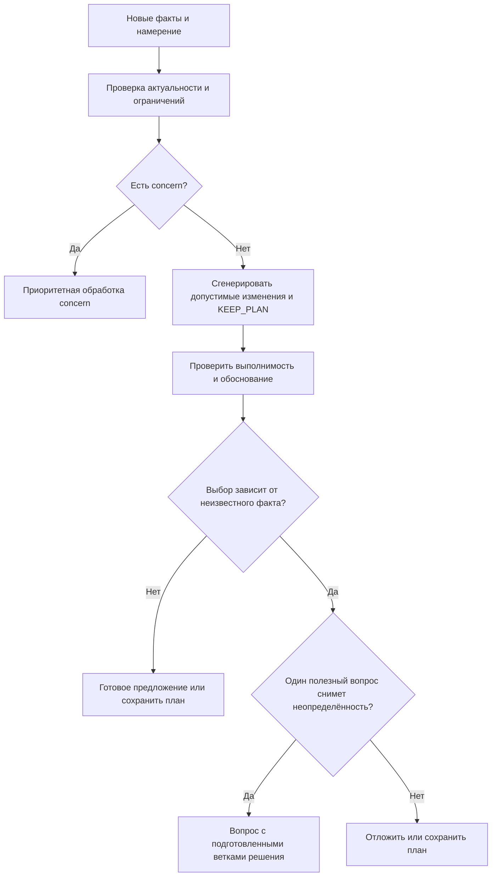

# Live Coach: движок обоснованных вмешательств

Ход реализации: [backend-срез и оставшиеся этапы](live-coach-behavior-implementation.md).
2026-09-19. Проект решения, не реализация. Дополнение к
[архитектуре поведения](live-coach-behavior-architecture.md).

## 1. Основное решение

Развивать свой небольшой детерминированный движок на Kotlin вокруг существующего
AutoregulationEngine. Из открытых проектов заимствовать архитектурные идеи программирования
прогрессии, но не импортировать универсальные числовые пороги как доказанные правила тренировки.

Изменить единицу результата: вместо «есть повод поговорить» движок возвращает
«есть готовое изменение», «есть один вопрос, разделяющий варианты изменения» или «оставить план».

Цель — минимизировать путь до обоснованного полезного решения. Сохранение плана и отказ
от вмешательства тоже успешные исходы. Уменьшение числа сообщений не должно искусственно
увеличивать число коррекций или превращать неясные данные в уверенные назначения.

Разделить три независимых решения:

1. Decision engine: что допустимо и полезно изменить и каких данных для этого не хватает.
2. Behavior engine: когда доставить решение и как вписать его в текущий диалог.
3. Application engine: разрешено ли применить именно эту версию изменений сейчас.

## 2. Что найдено на GitHub

Проверены публичные README, документация и доступные лицензии, но проекты не запускались,
их алгоритмы не прошли аудит и клиническая эффективность не подтверждена фактом публикации кода.
Поиск не выявил готовую библиотеку, совмещающую нашу модель тренировки, live-вмешательство,
минимизацию уточнений, объяснение и восстановление после сбоев.

| Проект | Что есть | Применимость |
|---|---|---|
| [Liftosaur](https://github.com/astashov/liftosaur) | Liftoscript: правила прогрессии, update во время тренировки и progress после завершения | Лучший ориентир для разграничения текущей коррекции и будущей прогрессии; полноценное приложение, не готовый Kotlin-модуль |
| [wger](https://github.com/wger-project/wger) | Плановые изменения параметров и условия их выполнения | Полезны декларативные правила и requirements; live-диалог нужно реализовать отдельно |
| [strength_tracker](https://github.com/GunnarStrandbergAB/strength_tracker) | README описывает детерминированное планирование, APRE, арбитраж противоречивых коррекций и AI-пояснения | Интересен принцип «расчёт отдельно, формулировка отдельно»; Swift-приложение с собственными предположениями |
| [Apache KIE / Drools](https://github.com/apache/incubator-kie) | Универсальные правила и decision tables | Тренерских знаний нет; рассмотреть, если множество правил будут редактировать специалисты вне кода |
| [Easy Rules](https://github.com/j-easy/easy-rules) | Небольшой Java rules engine | В maintenance mode с декабря 2020; сейчас свой typed evaluator проще оправдать |
| [Timefold Solver](https://github.com/TimefoldAI/timefold-solver) | Оптимизация по ограничениям, Java/Kotlin | Возможен для большой задачи перепланирования; не определяет физиологическую обоснованность решения |

Liftosaur: [описание update/progress](https://github.com/astashov/liftosaur/blob/master/docs/content/liftoscript.md),
[лицензия AGPL-3.0](https://github.com/astashov/liftosaur/blob/master/LICENSE).
wger: [requirements и progression](https://wger.readthedocs.io/en/stable/manual/routines.html),
[AGPL-3+ в документации](https://wger.readthedocs.io/en/stable/).
У strength_tracker файл [LICENSE](https://github.com/GunnarStrandbergAB/strength_tracker/blob/main/LICENSE)
обозначен MIT, тогда как README пишет «Private project»: перед переносом кода нужно разрешить
это несоответствие. Для предлагаемой собственной реализации копирование кода не требуется.

Дополнительно просмотрен [minmax-selfcoached](https://github.com/antler22/minmax-selfcoached):
узкое приложение под конкретную программу, не универсальный движок; явная лицензия
на основной странице не обнаружена. В shortlist для интеграции не включён.

## 3. Что означает «обосновано»

Каждое решение имеет три основания, которые нельзя смешивать:

- Факты этого пользователя: результат, явное намерение, доступное оборудование и время.
- Выбранная программа/политика: что сохраняем, какие изменения допустимы и на какой срок.
- Поддержка метода исследованиями: область применения и ограничения; не доказательство конкретного порога.

Исследование [Helms et al., 2018](https://pubmed.ncbi.nlm.nih.gov/29628895/) сравнивало
RPE- и процентное назначение нагрузки у 21 тренированного мужчины за 8 недель.
Обе группы улучшились, статистически значимых межгрупповых различий не было.
Это поддерживает рассмотрение авторегуляции как подхода, но не правило «минус 3 повтора → минус 5%»
и не доказывает превосходство нашего движка. Исследовательский target RPE не переносится
автоматически в продукт, где текущий контракт запрещает назначать целевой RIR.

[Steele et al., 2017](https://pubmed.ncbi.nlm.nih.gov/29204323/) показали несовершенную точность
предсказания повторов до отказа у 141 участника. Это аргумент за работу с неопределённостью;
результаты этого протокола не задают точную ошибку каждой введённой пользователем оценки RIR.

Статья [PMID 33337690](https://pubmed.ncbi.nlm.nih.gov/33337690/) встретилась в поиске,
но карточка PubMed помечена Retracted Publication; из доказательной базы исключена.

Для каждого RuleSpec хранить: ruleId/version, applicability, requiredFacts, disqualifiers,
allowedActions, bounds, evidenceReferences, rationale, limitations и provenance параметров:
PROGRAM / USER_PREFERENCE / PRODUCT_HEURISTIC / EMPIRICALLY_CALIBRATED.

Числа нынешнего движка — 3 повтора, 5% веса, 30 секунд отдыха, 90 дней истории, две прошлые
тренировки — стартовые эвристики существующего кода. Их следует вынести в версионированную
конфигурацию и проверить; нельзя выдавать их за универсальные научные нормы.

## 4. Что меняем относительно текущего кода

В [CoachRunTools.initiative](../src/main/kotlin/tech/valerochkagym/service/ai/CoachRunTools.kt)
результат calculation превращается в assessment.explanation(). В evaluate этот текст становится
сообщением для LLM. Даже если AutoregulationEngine вернул операции, инициативный путь
не передаёт их как окончательный пакет: модель снова вызывает инструменты и формирует proposal.

Это создаёт лишний цикл интерпретации. Вместо String? возвращать InterventionDecision:
готовый plan, вопрос с вариантами, наблюдение без показа или concern.
Готовые ADJUST направлять через общий validator/ProposalFactory в существующий proposal lifecycle.
LLM не должен заново рассчитывать уже проверенные числа.

Также сейчас calculate выбирает первую подходящую ветку; одно правило может скрыть другое.
Предлагается собирать сигналы независимо, затем генерировать кандидатов и явно разрешать конфликты.
Приоритет safety остаётся жёстким ограничением, а не весом среди других факторов.

Входной DTO WorkoutSnapshot уже содержит часть target/original-полей, но JSON mapper
CoachRunTools.snapshot переносит не все из них. Нужен явный контракт происхождения плана:
PROGRAM_PRESCRIBED, USER_CONFIRMED, COPIED_FROM_HISTORY, UNKNOWN. Скопированное значение
не считать обязательной целью. Не строить новую policy на полях, которые до неё не доходят.

## 5. Алгоритм выбора



### Шаг 1. Нормализовать факты

Fact<T>: value, source, observedAt, scope, revision, quality, uncertainty.
Отдельные значения: unknown, точное значение, диапазон, явно отрицаемый факт.
Отсутствие PAIN не равно подтверждённому отсутствию боли; отсутствие RIR не равно RIR=0.
Система не должна требовать анкету об отсутствии боли перед каждым обычным предложением,
но известный concern блокирует обычную оптимизацию и требует своего маршрута.

Работать с target/actual раздельно. Историю сопоставлять по упражнению, варианту оборудования,
весу, номеру и типу подхода, режиму программы; не сравнивать рабочий подход с разминкой/дроп-сетом.
Недостаток истории не мешает выполнить явную команду пользователя.

### Шаг 2. Получить сигналы

Например: EXPLICIT_CHANGE_REQUEST, TIME_INFEASIBLE, EQUIPMENT_UNAVAILABLE,
CONFIRMED_HARDER, UNEXPLAINED_PERFORMANCE_CHANGE, PLAN_TARGET_MISSED,
REPEATED_PATTERN, SAFETY_CONCERN. Сигнал хранит evidenceIds и scope.
Несколько производных от одного результата не считать независимыми подтверждениями:
падение повторов и падение e1RM из тех же повторов — один источник.

Сигнал отклонения не диагностирует причину. Падение повторов может быть ожидаемым,
намеренным или связанным с отдыхом; важно, меняется ли от этой неопределённости действие.

### Шаг 3. Сгенерировать небольшой набор кандидатов

KEEP_PLAN всегда присутствует. Остальные — локальная коррекция следующего рабочего подхода,
изменение отдыха в разрешённой области, сокращение выбранных оставшихся подходов,
перестановка/замена доступного упражнения, уточнение.

Сначала изменения на один следующий шаг, затем повторная оценка. Не переписывать неделю
из-за одного подхода. Прогрессию следующей тренировки запускать отдельным событием WorkoutFinished
и отдельным rule pack с правилами выбранной программы.

### Шаг 4. Применить жёсткие ограничения

- Известные ограничения и concern; принадлежность ID и свежая версия.
- Выполненные результаты неизменны, кроме отдельной явной пользовательской коррекции.
- Вес достижим на конкретном оборудовании; неизвестное оборудование не равно любому доступному.
- Изменение в пределах политики; нельзя случайно усиливать другой параметр при снижении одного.
- Совместимость операций: нельзя удалить подход и затем менять его; сначала симулировать весь пакет.
- Выбранная программа, явные предпочтения, закреплённые упражнения и завершённые части сохраняются.
- Истёкшие, повторные или ранее отклонённые кандидаты без новых оснований исключаются.

### Шаг 5. Выбрать минимально достаточное изменение

На старте использовать объяснимое лексикографическое сравнение:

1. Удовлетворяет явной команде или устраняет подтверждённое ограничение.
2. Требует меньше неподтверждённых предположений.
3. Лучше сохраняет подтверждённые приоритеты программы.
4. Меняет меньше подходов и параметров, остаётся в допустимых границах.
5. Требует меньше времени/перестановок оборудования/действий пользователя.

KEEP_PLAN выигрывает, когда нет обоснованного преимущества изменения. Не вводить фиктивный
«confidence=0.92»: уровни достаточности фактов и список отсутствующих зависимостей честнее.
Статистические вероятности можно добавить после сбора калибровочных данных.

### Шаг 6. Решить, нужен ли вопрос

Спросить только если разные правдоподобные ответы изменяют допустимость, направление,
область или значимую величину изменения. Если решение остаётся тем же — вопрос лишний.

Пример: «осталось 10 минут» с известными приоритетами и длительностями позволяет сразу
предложить сокращённый план. RIR не влияет на этот выбор, поэтому его не спрашиваем.
Если неизвестно, какое упражнение обязательно сохранить, один выбор приоритета может быть полезен.

Для неизвестного факта f можно сравнить решения при возможных ответах. В первой версии
QuestionPlanner использует заранее проверенные ветки правил. Он не вызывает LLM по одному разу
на каждую гипотезу и не умножает стоимость анализа. Не более одного дискриминирующего вопроса
на обычное вмешательство — цель UX, а не запрет необходимых уточнений при concern.

Если ответа нет или после него данных всё ещё недостаточно: сохранить план/отложить,
предложить явное ручное действие или запросить необходимую конкретику. Не снижать требования
к обоснованности ради метрики «один вопрос».

## 6. Действия вместо длинной переписки

### Готовый вариант: ноль уточнений

Вход: пользователь явно отметил «тяжелее ожидаемого», записал фактический результат;
есть допустимый меньший вес на этом оборудовании, следующий рабочий подход и нет известного concern.

Карточка: «Вы отметили, что подход оказался тяжелее ожидаемого. Предлагаю следующий подход:
60 → 57,5 кг; остальное оставить». Кнопки: «Применить 57,5 кг», «Оставить 60 кг».
Числа здесь иллюстрируют UX; такой шаг допускается только проверенной политикой в конкретном контексте.
Не спрашивать повторно «точно было тяжело?» и «хочешь, я предложу изменение?».

### Неясная причина: один вопрос

Вход: необычное падение повторов без явного намерения. Если разные причины меняют решение,
показать короткий вопрос с фактическими вариантами («Остановился специально», «Было тяжелее»,
«Прервали», свободный ответ), после него сразу готовую карточку без нового анализа всей истории.
Ветка CONFIRMED_HARDER заранее рассчитана, но проверяется заново по актуальным фактам.

Можно сократить и второй шаг: «Если хотите облегчить следующий подход, доступен вариант 57,5 кг»
с кнопкой «Следующий — 57,5 кг». Это явный выбор конкретного действия пользователем,
а не скрытое предположение о причине. Кнопка видна только когда этот вариант допустим и понятен.
Она не записывает выдуманный факт FATIGUE/HARDER_THAN_EXPECTED.

### Несколько ограничений: один пакет

«Осталось 10 минут, тренажёр занят». Сначала подготовить согласованный вариант оставшейся
тренировки по известным приоритетам и оборудованию, показать весь diff одним предложением.
Если доступность замены неизвестна, предложить конкретные варианты выбора. Не вычислять вес
для нового упражнения прямым переносом килограммов со старого.

Кнопка, которая одновременно отвечает и применяет, должна прямо называть изменение.
Нейтральная «Да»/«Было тяжело» подтверждает только факт и не даёт согласия на скрытые операции.
Любое новое действие имеет proposalId, version, scope и понятный preview.

## 7. Начальный каталог правил

| Ситуация | Достаточные основания | Результат | Когда уточнять |
|---|---|---|---|
| Явно попросили изменить вес/отдых | Цель и область однозначны, значение валидно | Сразу пакет на подтверждение | Неясно, какой подход или текущий/будущий отдых |
| Стало тяжелее ожидаемого | Явный отчёт, рабочий результат, допустимый шаг, политика | Локальный кандидат облегчения | Отсутствующее оборудование/ограничения меняют выбор |
| Только снизились повторы | Сопоставимые факты; причина пока неизвестна | KEEP_PLAN либо один вопрос/выбор | Только при существенном и полезном для решения отклонении |
| Только RIR=0 | Это факт усилия, не нарушение плана | Обычно KEEP_PLAN | Другое существенное основание требует уточнения |
| Времени меньше, чем требует план | Дедлайн, список оставшегося, оценка длительности, приоритеты | Один сокращённый вариант | Неизвестный приоритет меняет состав |
| Оборудование недоступно | Явный факт и известные доступные альтернативы | Перестановка или конкретная замена | Нельзя выбрать достижимую альтернативу |
| Уже сказали «усилие запланировано» | Факт относится к этому подходу/эпизоду | KEEP_PLAN | Новое независимое основание |
| Боль/нарушение техники | Явный concern | Приоритетная обработка, обычные коррекции заблокированы | Нужная конкретика по concern; без лимита ради UX |
| Повторные промахи программы | Подтверждённые цели и правила программы | Кандидат для следующей сессии | Программа/намерение неизвестны |
| Разминка, дроп-сет, AMRAP | Специальный тип подхода | Только специализированный rule pack | Не считать автоматически обычным WORK |

TimePlanner считает длительность диапазоном: подходы + отдых + переходы/смена оборудования.
Если весь интервал укладывается — повода нет; если даже нижняя граница не укладывается —
конфликт явный; при пересечении дедлайна зависит от строгости ограничения.
Для строгого дедлайна использовать консервативную оценку и показывать её как приблизительную.
При невозможности сохранить все обязательные элементы возвращать конфликт/выбор приоритета.
Не обещать точное время и не удалять обязательное упражнение молча.

Для замены нужны curated альтернативы с ограничениями и доступностью. Совпадение мышцы
само по себе не гарантирует равноценность упражнения или пригодность при боли.

## 8. API движка и исполнительный путь

Эскиз типов:

```kotlin
sealed interface InterventionDecision {
    data class Keep(val reason: DecisionReason) : InterventionDecision
    data class Propose(val plan: ValidatedPlan) : InterventionDecision
    data class Ask(val question: DecisionQuestion) : InterventionDecision
    data class Defer(val until: RecheckCondition) : InterventionDecision
    data class Concern(val response: ConcernResponse) : InterventionDecision
}

fun decide(
    facts: CoachFacts,
    intent: UserIntent?,
    policy: InterventionPolicy,
    memory: DecisionMemory
): InterventionDecision
```

ValidatedPlan: operations, beforeAfter, evidenceIds, ruleIds, reasonCode, assumptions,
dependencies, baseRevision, expiresAt, nextObservation. DecisionQuestion: questionId,
missingFact, options и ссылки на рассчитанные ветки. Промежуточные ветки нельзя применять
как действующее предложение без повторной проверки и правильного согласия пользователя.

Модули: FactNormalizer → SignalDetector → CandidateGenerator → ConstraintValidator →
CandidateSelector → QuestionPlanner. ExplanationRenderer строит краткое обоснование из facts/rules.
Каждый модуль — обычные Kotlin-типы и чистые функции. Время и policy передаются явно.

Два маршрута:

- Структурированное событие/кнопка → rules → готовый proposal. Ноль LLM-вызовов на расчёт.
- Свободный текст → один structured intent extraction при необходимости → rules → proposal.
  Только сложный новый запрос уходит в существующий ограниченный tool loop.

LLM может переформулировать объяснение, но не менять operations, scope и числа.
Для карточек сначала шаблоны с типизированными значениями; необязательная генерация текста
не блокирует появление готового решения и при сбое заменяется шаблоном.

Быстрый путь не обходит проверку операций: общий валидатор, симуляция patch, durable proposal,
событие в транзакции и прежний ledger применения. Детали события без LLM/run описаны
в основном архитектурном документе: нынешний stream требует run FK, это нужно мигрировать.

Ответ на вопрос обрабатывается атомарно: questionId + answerId + expectedVersion;
факт сохраняется, ветка переоценивается и готовый результат публикуется.
Повтор ответа возвращает прежний итог. Старый вопрос не применяется к новому подходу.
Открытый вопрос закрывается при потере зависимости, а не бессрочно блокирует инициативу.

## 9. Скорость, память и предотвращение колебаний

Не вызывать LLM на heartbeat/countdown. Собирать факты при семантических событиях,
кэшировать нормализованную историю/оборудование по версиям, инвалидировать по зависимостям.
Кандидатов в первой версии мало, достаточно ограниченного перебора; solver пока не нужен.

Цели для будущего benchmark, не измеренные показатели: p95 rules < 50 мс на согласованном
снимке в памяти; ноль LLM-вызовов для структурированных типовых случаев; 0–1 уточнение
до готового обычного предложения. Отдельно измерять queue/network/intent extraction.

После коррекции хранить interventionKey, применённый patch, исходные факты, scope и nextObservation.
Не менять вес вверх-вниз на каждом обновлении снимка. Новая обычная оценка того же параметра
ждёт следующего релевантного результата; явная команда/новый concern проходит отдельно.

Повторный отказ блокирует ту же идею на прежних основаниях. Изменение revision или очередной
heartbeat не является новым доказательством. Отказы анализировать по причине, а не обучать
движок «никогда не помогать» после одного отклонения.

## 10. Проверка качества и первый этап

Метрики: число уточнений до proposal и до APPLIED; время до первого валидного решения;
доля исправлений/откатов, неверных уточнений, stale-предложений, повторных тем и отключений coach.
Доля принятия — вспомогательная метрика. Не оптимизировать принятие ценой навязчивости.
Нужны и сценарии KEEP_PLAN: иначе движок будет оцениваться только по умению менять тренировку.

Тестовая матрица: одинаковые факты → одинаковое решение; смена irrelevant-поля не меняет план;
конфликтующие сигналы → один совместимый пакет; вопросы действительно разделяют решения;
RIR неизвестен/4+ не подменяется числом; цели из истории не становятся предписанием;
concern обходит time/silence gates; шаг веса доступен; завершённые подходы сохраняются;
дубли и устаревшие ответы не применяют изменение повторно; одна просадка не перестраивает неделю.

Для каждого правила — fixtures с обоснованным вмешательством, KEEP_PLAN, отказом, missing-data
и конкурирующим правилом. Затем replay реальных обезличенных эпизодов в shadow mode,
экспертная оценка спорных случаев и поэтапное включение. Исход после вмешательства фиксировать,
но не считать его причинным доказательством эффективности без подходящего дизайна исследования.

Рекомендуемый первый срез реализации:

1. Возвращать typed decision и сохранять готовые операции текущего AutoregulationEngine.
2. Сначала вынести concern и валидатор; исключить повторное вычисление пакета моделью.
3. Два быстрых сценария: «тяжелее ожидаемого» и «мало времени», с явными prerequisites.
4. Один DecisionQuestion с заранее подготовленными ветками и прямыми action-кнопками.
5. В playground показывать facts → rules → candidates → выбранный plan / нужный вопрос.
6. Сравнить старый и новый путь по времени, числу сообщений и корректности, затем расширять правила.

Это уточняет предыдущий архитектурный пример: вопрос после подхода нужен только в ветке
неопределённости. Если фактов достаточно, первый ответ тренера уже содержит готовое изменение.
